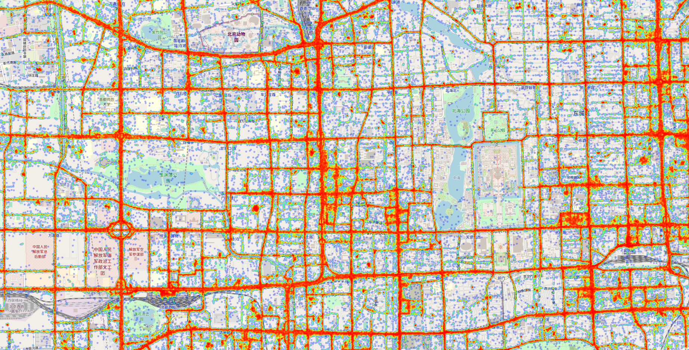

# Urban Analytics: Beijing

This project is a visualization tool for location based IOT data transmissions. The intended use of this program is for the analysis of fleet vehicle movement. Latitude and longitude transmissions are engineered to create custom heatmaps and an accurate temporal analysis of the IOT enabled objects. 

Sample data for this project has been provided by Microsoft Research. 

https://www.microsoft.com/en-us/research/publication/t-drive-trajectory-data-sample/

# Example




# Description of Data

The T-Drive dataset contains the GPS trajectories of 10,357 taxis during the period of February 2nd to February 8th 2008 within Beijing. The dataset contains roughly 15 million individual IOT transmissions. 

Each row of data has the following CSV fields:

```
taxi id, date time, longitude, latitude
```

# About the Project

Notable Features

* File I/O functions are processed in parallel
* Interactive Folium heatmap of IOT activity


### Prerequisites

Dependencies can be installed via...

```
pip install requirements.txt
```

Please ensure that config.json is updated with the correct filepaths for your machine.


### Running

Please ensure that the read path in config.json points to the input data. 

Then run

```
python3 main.py
```

## Built With

* [Folium](https://github.com/python-visualization/folium) - Mapping library
* [Pandas](https://pandas.pydata.org/) - Dataframe object

## Contributing

Feeback and constructive criticism is greatly appreciated!

## Author

* **Andrew Moss** - *Creator* - [agmoss](https://github.com/agmoss)

## License

This project is licensed under the MIT License - see the [LICENSE.md](LICENSE.md) file for details

## Citations

Jing Yuan, Yu Zheng, Xing Xie, and Guangzhong Sun. Driving with knowledge from the physical world.
In The 17th ACM SIGKDD international conference on Knowledge Discovery and Data mining, KDD
’11, New York, NY, USA, 2011. ACM.

Jing Yuan, Yu Zheng, Chengyang Zhang, Wenlei Xie, Xing Xie, Guangzhong Sun, and Yan Huang. T-
drive: driving directions based on taxi trajectories. In Proceedings of the 18th SIGSPATIAL International
Conference on Advances in Geographic Information Systems, GIS ’10, pages 99–108, New York, NY, USA,
2010. ACM.
